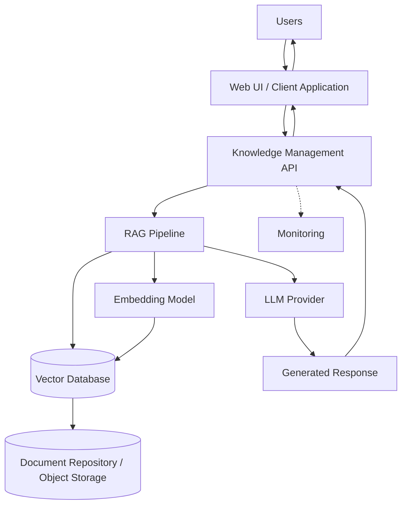

# Knowledge Management Agent — Enterprise AI PoC Scope Document

**Type:** Generative AI Proof of Concept | **Status:** Draft for Review

The Knowledge Management Agent uses LLMs and Retrieval-Augmented Generation (RAG) to generate operational documentation (runbooks, SOPs, KB articles, RCA summaries) and answer natural language questions against an organization's document corpus.

---

## 1. Scope

### In Scope
- AI generation of runbooks, SOPs, KB articles, and RCA summaries
- RAG-based retrieval grounding LLM responses in ingested documents
- Semantic search over the ingested document corpus
- Document ingestion pipeline: parsing, chunking, embedding
- Source integration with SharePoint and/or Confluence
- Web-based conversational interface for querying the knowledge base
- Basic role-based access control (non-production grade)
- Evaluation against a defined test document set and question set

### Out of Scope
- Production deployment (scaling, high availability, disaster recovery)
- Fine-tuning of LLMs or embedding models
- Multi-language support
- Multi-agent orchestration
- ITSM tool automation (ticket creation, updates, closure)
- Live integration with production systems or production data
- Enterprise IAM/SSO integration and formal security accreditation

### Future Scope
- ITSM platform integration (e.g., ServiceNow) for automated draft generation
- Multi-agent orchestration for generation, retrieval, and review workflows
- Fine-tuning on organization-specific terminology and incident history

---

## 2. Objectives

- Generate runbooks and SOPs from raw operational input
- Generate KB articles from support tickets and troubleshooting sessions
- Summarize RCA reports into structured summaries
- Capture lessons learned and feed them back into runbooks/SOPs
- Retrieve relevant document chunks by semantic meaning, not keywords
- Answer natural language questions with source-cited responses
- Reduce time spent searching for operational information
- Reduce interruptions to subject matter experts (SMEs)

---

## 3. Success Metrics

| Metric | Target |
|---|---|
| Retrieval accuracy (relevant document in top-3 results) | ≥ 85% |
| Response grounding (answer supported by retrieved source) | ≥ 90% |
| End-to-end query response time | ≤ 8 seconds |

---

## 4. Functional Requirements

- Ingest, chunk, and embed documents (PDF, DOCX, HTML, Markdown)
- Retrieve relevant chunks and answer queries with source citations
- Generate runbooks, SOPs, KB articles, and RCA summaries
- Enforce role-based access control

## 5. Non-Functional Requirements

- English-language content only
- Query response within 8 seconds
- Non-production/synthetic data only, no PII
- Cloud-agnostic deployment (AWS, Azure, GCP, or on-premises)

---

## 6. Technology Stack

**Note (verified against the actual codebase, not the original proposal):** the table
below replaces the original options-menu style ("OpenAI, Azure OpenAI, Claude, or
Gemini") with what's actually implemented and what's actually running today. Several
originally-proposed options (FAISS/Pinecone/Weaviate, SharePoint/Confluence, S3/Blob/GCS
object storage) were never built — confirmed by grepping the codebase for any trace of
them and finding none.

| Layer | Technology (as implemented) | Purpose |
|---|---|---|
| Frontend | React (Vite), served via nginx in production | Q&A chat, document-generation forms, and file-ingestion UI, tab-gated by role |
| Backend / API | Python, FastAPI | RAG orchestration and REST endpoints (`/auth`, `/query`, `/generate`, `/ingest`, `/health`) |
| MCP Server | Python, official `mcp` SDK (stdio transport) | Exposes the same capabilities as callable tools for AI agents (Claude Code/Desktop) — a thin REST client over the same API, not a separate implementation |
| LLM | **Currently deployed: Groq** (`openai/gpt-oss-120b`). Also implemented and selectable via `LLM_PROVIDER`: OpenAI, Azure OpenAI, Anthropic Claude, Google Gemini, or an offline `mock` | Document generation and grounded question answering |
| Embedding Model | **Currently deployed: local, open-source** `sentence-transformers/all-MiniLM-L6-v2` (in-process, CPU, no API key/external call). Also implemented and selectable via `EMBEDDING_PROVIDER`: OpenAI, Azure OpenAI, Gemini, or `mock` | Converts text to vector representations |
| Vector Database | **ChromaDB only** (self-hosted, embedded `PersistentClient`) — FAISS/Pinecone/Weaviate were never implemented | Stores and indexes embeddings for semantic search |
| Document Repository | **Local file upload only** (PDF, DOCX, HTML, Markdown, plain text) — no SharePoint/Confluence integration exists | Source of documents to ingest |
| Object Storage | **None in the application itself.** ChromaDB's on-disk data persists via a Kubernetes PersistentVolumeClaim (AWS EBS); container images live in Amazon ECR | Persistence for the vector store and deployed artifacts |
| Authentication | JWT (PyJWT) + 2-role RBAC (`viewer` / `author`) — explicitly non-production-grade | Access control for the PoC environment |
| Deployment | Docker; **AWS EKS** (Kubernetes) provisioned via Terraform; GitHub Actions CI/CD authenticating to AWS via OIDC | Hosts and deploys the containerized application |

---

## 7. Architecture

- **Web UI** — captures queries and displays generated answers with citations
- **Knowledge Management API** — routes requests to retrieval or generation
- **RAG Pipeline** — coordinates embedding, retrieval, and prompt assembly
- **Embedding Model** — converts documents and queries into vectors
- **Vector Database** — stores embeddings, returns top-matching chunks
- **LLM Provider** — generates grounded answers and draft documents
- **Document Repository / Object Storage** — source and generated document storage
- **Monitoring** — logs usage, latency, and retrieval/generation quality

---

## 8. Workflow

**Ingestion:** upload/pull document → parse and normalize → chunk → embed → store in vector database

**Query:** submit question → embed query → retrieve top-matching chunks → assemble grounded prompt → LLM generates answer → return answer with citations

---

## 9. Assumptions & Constraints

**Assumptions**
- Source documents exist in PDF, DOCX, HTML, or Markdown
- SharePoint or Confluence access is available for the PoC
- An LLM provider API is provisioned with sufficient quota
- Test documents and queries are non-production/synthetic

**Constraints**
- No fine-tuning of LLM or embedding models
- No production-grade security controls implemented
- Generation quality depends on source document quality
- Evaluation limited to a defined test document and question set

---

## 10. Benefits

- Faster onboarding through self-service Q&A
- Reduced manual documentation effort
- Reduced SME interruption for routine questions
- Faster access to runbooks during incidents
- Consistent documentation structure across teams

---

*End of Document*
