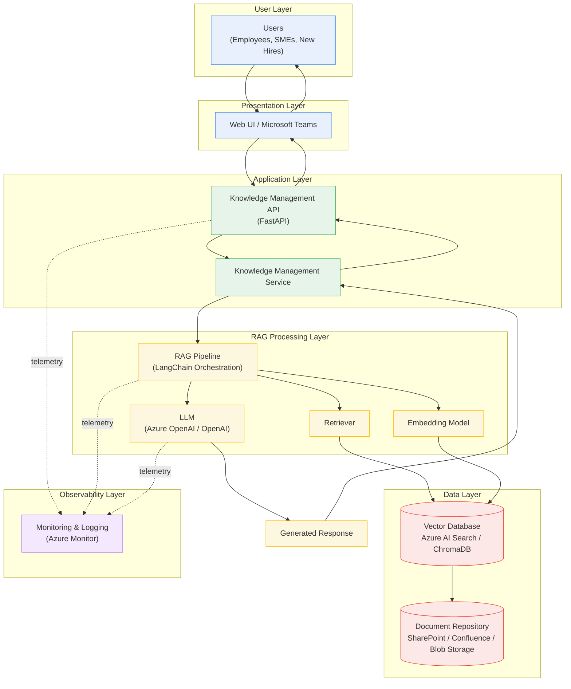
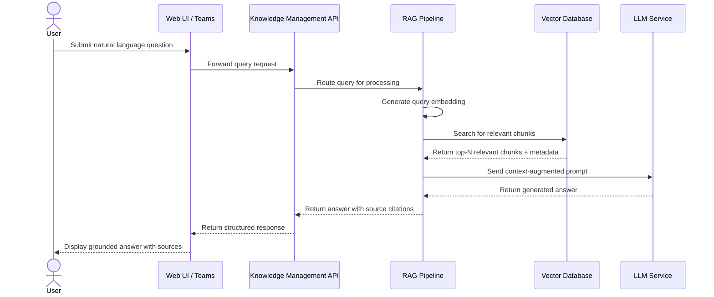

# Knowledge Management Agent

**Document Type:** Solution Design Document
**Project Type:** Enterprise Generative AI Proof of Concept
**Classification:** Internal / Technical Architecture Documentation
**Status:** Draft for Review

---

## Document Control

| Attribute | Detail |
|---|---|
| Document Title | Knowledge Management Agent — Enterprise AI PoC |
| Version | 1.0 |
| Prepared For | Enterprise Architecture Review Board |
| Document Owner | Solutions Architecture Team |
| Review Cycle | Pre-PoC Kickoff |

---

## Table of Contents

1. Project Overview
2. Project Objectives
3. Project Scope
4. Technology Stack
5. High-Level Architecture
6. Architecture Diagram
7. Solution Workflow
8. Assumptions
9. Constraints
10. Expected Business Benefits

---

## 1. Project Overview

### 1.1 Background

Enterprise organizations accumulate vast amounts of operational knowledge over time, including incident runbooks, standard operating procedures (SOPs), root cause analysis (RCA) reports, architecture decisions, troubleshooting guides, and lessons learned from production events. This knowledge is typically distributed across a fragmented set of repositories: SharePoint sites, Confluence spaces, shared drives, email threads, chat history, and, in many cases, the personal notes and memory of individual subject matter experts (SMEs). As organizations scale, this fragmentation becomes a significant operational liability. Knowledge that is not captured, indexed, or easily retrievable effectively does not exist at the moment it is needed most — during an incident, an audit, or the onboarding of a new team member.

The Knowledge Management Agent is proposed as a Generative AI-powered platform that addresses this problem directly. It combines Large Language Models (LLMs) with Retrieval-Augmented Generation (RAG) to create a system that can both generate structured operational documentation from raw inputs (such as incident notes, chat logs, or engineer commentary) and allow employees to query the organization's collective knowledge using natural language, receiving accurate, context-grounded answers instead of having to manually search through disparate document repositories.

### 1.2 Current Challenges in Enterprise Knowledge Management

Most enterprises, regardless of industry, face a common set of structural problems in how operational knowledge is created and maintained:

- **Tribal knowledge concentration.** Critical operational understanding often resides in the heads of a small number of senior engineers or SMEs rather than in written form. When these individuals are unavailable, on leave, or leave the organization, that knowledge is effectively lost.
- **Documentation debt.** Runbooks, SOPs, and knowledge base (KB) articles are frequently written once and never updated as systems evolve, resulting in documentation that is misleading or actively harmful when followed during an incident.
- **Inconsistent documentation quality.** Because documentation is typically a manual, low-priority task performed under time pressure, the quality, structure, and completeness of documents vary widely across teams.
- **Slow onboarding.** New employees and contractors spend a disproportionate amount of time searching for information, asking SMEs repetitive questions, and piecing together an understanding of systems from outdated or scattered sources.
- **Poor searchability.** Traditional keyword-based search tools built into SharePoint, Confluence, or file shares are ill-suited to natural language questions and often fail to surface the most relevant document when the searcher does not know the exact terminology used in the source material.
- **RCA and lessons-learned attrition.** Post-incident reviews are often written, distributed once, and then forgotten. The insights they contain rarely make their way back into runbooks or SOPs, causing the same classes of incidents to recur.
- **High cost of SME dependency.** Repeated interruptions to SMEs for information that should be self-service reduce their productivity and create a bottleneck that scales poorly as the organization grows.

### 1.3 Why Generative AI Is Suitable

Generative AI, and specifically the combination of LLMs with Retrieval-Augmented Generation, is well suited to this problem for several reasons. LLMs are capable of synthesizing unstructured, informally written input (chat transcripts, raw notes, verbal-style incident descriptions) into structured, professional documentation formats such as runbooks and SOPs, a task that is time-consuming and inconsistent when done manually. RAG architectures allow the system to ground its responses in the organization's actual, authoritative documents rather than relying solely on the model's general training data, which significantly reduces the risk of hallucinated or inaccurate answers. Additionally, semantic retrieval — powered by embedding models and vector databases — allows employees to search using natural, conversational language rather than needing to guess exact keywords, closely matching how people naturally think about and describe problems.

### 1.4 Vision of the Project

The vision for the Knowledge Management Agent is to establish an intelligent knowledge layer that sits above the organization's existing document repositories (SharePoint, Confluence, and blob storage) and acts as both a documentation co-author and an always-available expert assistant. Rather than replacing human expertise, the system is designed to augment it: automatically drafting first versions of operational documentation, keeping the organization's collective knowledge searchable and current, and giving every employee — regardless of tenure — the ability to ask a question in plain language and receive a grounded, accurate, and traceable answer.

### 1.5 Expected Outcome

At the conclusion of this Proof of Concept, the project is expected to demonstrate a working, end-to-end pipeline capable of ingesting a representative set of enterprise documents, generating structured knowledge artifacts (runbooks, SOPs, KB articles, RCA summaries), and answering natural language questions against that corpus with grounded, source-referenced responses. The PoC will produce quantitative and qualitative evidence — including retrieval accuracy, response relevance, and generation quality — sufficient to inform a go/no-go decision on a broader pilot or production investment.

---

## 2. Project Objectives

The Knowledge Management Agent PoC is built around a set of concrete, demonstrable objectives. These objectives are grouped into documentation automation objectives and knowledge access objectives.

### 2.1 Documentation Automation Objectives

- **Automate runbook generation.** Convert raw operational input (incident notes, engineer chat logs, verbal walkthroughs) into structured, step-by-step runbooks following a consistent enterprise template.
- **Generate Standard Operating Procedures (SOPs).** Produce SOP documents for recurring operational tasks, formatted consistently with organizational documentation standards.
- **Generate Knowledge Base articles.** Automatically draft KB articles from support tickets, troubleshooting sessions, or SME input, ready for human review and publication.
- **Summarize RCA documents.** Condense lengthy root cause analysis reports into concise, structured summaries highlighting root cause, impact, resolution, and preventive actions.
- **Capture lessons learned.** Extract and structure lessons-learned entries from post-incident reviews so that they can be systematically fed back into runbooks and SOPs.

### 2.2 Knowledge Access Objectives

- **Enable semantic document retrieval.** Allow the system to retrieve the most contextually relevant document chunks based on the meaning of a query, not just keyword matches.
- **Provide AI-powered enterprise search.** Deliver a natural language question-answering interface that spans the organization's ingested knowledge corpus.
- **Improve onboarding.** Reduce the time required for new employees to become productive by giving them a self-service, conversational way to learn about systems and processes.
- **Reduce SME dependency.** Decrease the frequency with which employees need to interrupt SMEs for information that is already documented or derivable from existing sources.
- **Improve documentation quality and consistency.** Standardize the structure, tone, and completeness of generated documentation across teams.

### 2.3 Measurable Success Criteria

| Objective | Success Metric | Target (PoC) |
|---|---|---|
| Runbook / SOP generation | Human reviewer acceptance rate (minimal edits required) | ≥ 80% acceptable on first draft |
| RCA summarization | Summary completeness against source (root cause, impact, resolution captured) | ≥ 90% coverage |
| Semantic retrieval accuracy | Relevant document retrieved in top-3 results | ≥ 85% |
| Question answering | Response grounded in retrieved source (no unsupported claims) | ≥ 90% grounded responses |
| Response latency | End-to-end query response time | ≤ 8 seconds (PoC environment) |
| Onboarding efficiency (simulated) | Reduction in time to locate a correct answer vs. manual search | ≥ 40% reduction |
| Documentation consistency | Adherence to defined template structure | 100% of generated documents |

---

## 3. Project Scope

### 3.1 In Scope

- AI-generated operational documentation, including runbooks, SOPs, KB articles, and RCA summaries.
- Retrieval-Augmented Generation (RAG) pipeline for grounding LLM responses in ingested enterprise documents.
- Semantic search over the ingested document corpus using vector embeddings.
- Automated document ingestion pipeline, including parsing, chunking, and embedding of source documents.
- Integration with a document repository (SharePoint and/or Confluence) as a source of truth for existing documentation.
- Storage of ingested and generated artifacts in a cloud blob storage layer.
- A conversational interface for querying the knowledge base, delivered through a lightweight web UI, with a future-ready integration point for Microsoft Teams.
- Basic role-based access control for the PoC environment (non-production grade).
- Logging and monitoring of system usage, retrieval performance, and generation quality for PoC evaluation purposes.
- Evaluation of generation and retrieval quality against a defined test document set and question set.

### 3.2 Out of Scope

- Full production deployment, including production-grade scaling, high availability, and disaster recovery.
- Fine-tuning of custom or proprietary LLMs; the PoC will use pre-trained foundation models via managed APIs.
- Multi-language support; the PoC is limited to English-language source documents and queries.
- Multi-agent orchestration or autonomous agentic workflows beyond the single-agent RAG pattern.
- Automatic incident detection or integration with monitoring/alerting systems to trigger documentation generation.
- IT Service Management (ITSM) tool automation, such as automatic ticket creation, updates, or closure.
- Live integrations with production systems, production data, or production SharePoint/Confluence tenants.
- Enterprise-wide identity and access management (IAM) integration; the PoC will use simplified authentication suitable for a controlled evaluation environment.
- Formal information security accreditation or compliance certification of the PoC environment.

### 3.3 Future Scope

Should the PoC be validated and approved for further investment, the following enhancements are recommended for subsequent phases:

- Full Microsoft Teams bot integration with adaptive cards, enabling conversational access directly within existing collaboration workflows.
- Multi-agent orchestration, allowing specialized agents for document generation, retrieval, quality review, and workflow routing to collaborate on complex tasks.
- Integration with ITSM platforms (such as ServiceNow) to automatically draft documentation from resolved tickets and incidents.
- Automatic incident detection integration with monitoring and observability platforms to trigger real-time runbook suggestions.
- Fine-tuning or domain adaptation of embedding and/or language models on organization-specific terminology and historical incident data.
- Multi-language support for global enterprise deployments.
- Production-grade security hardening, including enterprise IAM/SSO integration, data loss prevention (DLP), and audit logging aligned with compliance frameworks.
- Feedback-driven continuous learning, where user corrections and ratings are used to improve retrieval ranking and generation quality over time.
- Expanded connector ecosystem covering additional enterprise systems such as Jira, ServiceNow Knowledge Base, and Microsoft OneNote.

---

## 4. Technology Stack

The following technology stack has been selected to balance enterprise readiness, rapid PoC development velocity, and alignment with common Microsoft and open-source ecosystems used in enterprise environments.

| Layer | Technology | Purpose |
|---|---|---|
| Frontend | React (or lightweight web UI framework) | Provides the conversational chat interface and document review UI for the PoC. |
| Backend | Python | Core language for orchestration logic, RAG pipeline, and integration services. |
| API Framework | FastAPI | Exposes RESTful endpoints for document ingestion, query handling, and document generation, with built-in async support and OpenAPI documentation. |
| LLM | Azure OpenAI Service (GPT-family models) / OpenAI API | Performs natural language understanding, document generation (runbooks, SOPs, KB articles, RCA summaries), and grounded question answering. |
| Embedding Model | Azure OpenAI Embeddings (text-embedding-ada-002 or successor) / OpenAI Embeddings | Converts document chunks and user queries into vector representations for semantic similarity search. |
| Retrieval Framework | LangChain | Orchestrates the RAG pipeline, including chunking strategies, prompt templating, retriever configuration, and chaining of generation steps. |
| Vector Database | Azure AI Search (vector store) / ChromaDB | Stores and indexes document embeddings, enabling fast approximate nearest-neighbor semantic search. |
| Document Loader | LangChain Document Loaders (PDF, DOCX, HTML, Markdown connectors) | Extracts and normalizes text content from heterogeneous source document formats prior to chunking and embedding. |
| Document Repository | SharePoint / Confluence | Serves as the authoritative source of existing organizational documentation ingested into the pipeline. |
| Storage | Azure Blob Storage | Persists raw ingested documents, generated artifacts, and intermediate processing outputs. |
| Authentication | Azure Active Directory (Microsoft Entra ID) | Provides identity and access control for the PoC environment (simplified configuration, non-production scope). |
| Monitoring | Azure Monitor / Application Insights | Captures application logs, performance telemetry, and usage metrics for evaluating PoC success criteria. |
| Containerization | Docker | Packages the API, RAG pipeline, and supporting services into portable, reproducible container images. |
| Deployment | Azure App Service | Hosts the containerized application in a managed, scalable Platform-as-a-Service environment suitable for a PoC. |
| Version Control | GitHub | Manages source code, infrastructure configuration, and collaboration for the PoC development team. |

---

## 5. High-Level Architecture

The Knowledge Management Agent architecture is organized into distinct layers, each with a well-defined responsibility. This separation of concerns allows individual components — for example, the vector database or the LLM provider — to be replaced or upgraded independently as the solution matures beyond the PoC stage.

### 5.1 Users

**Purpose:** Represents the end users of the system, including operations engineers, SMEs, support staff, and new hires.
**Responsibilities:** Submit natural language queries, upload or provide source material for documentation generation, and review/approve AI-generated documents.
**Inputs:** Natural language questions; raw operational notes, transcripts, or documents intended for generation.
**Outputs:** Queries and content submissions sent to the Web UI / Teams layer.
**Interaction:** Interfaces exclusively through the Web UI or Microsoft Teams; has no direct access to backend services.

### 5.2 Web UI / Microsoft Teams

**Purpose:** Serves as the primary interaction surface for the system.
**Responsibilities:** Renders the chat interface, captures user input, displays generated documents and grounded answers with source citations, and (in future scope) integrates as a Teams bot.
**Inputs:** User queries and uploaded documents.
**Outputs:** Formatted requests sent to the Knowledge Management API; renders API responses back to the user.
**Interaction:** Communicates with the Knowledge Management API over authenticated HTTPS/REST calls.

### 5.3 Knowledge Management API

**Purpose:** Acts as the central orchestration and access-control layer for the entire system.
**Responsibilities:** Authenticates requests, routes queries to the appropriate downstream service (generation vs. retrieval), validates inputs, and aggregates responses.
**Inputs:** HTTP requests from the Web UI / Teams layer.
**Outputs:** Structured JSON responses containing generated documents, retrieved answers, or status information.
**Interaction:** Sits between the presentation layer and the LLM Service / RAG Pipeline; also emits telemetry to the Monitoring & Logging layer.

### 5.4 LLM Service

**Purpose:** Provides the generative reasoning capability of the system.
**Responsibilities:** Executes prompt-engineered requests for document generation (runbooks, SOPs, KB articles, RCA summaries) and produces grounded natural language answers using retrieved context supplied by the RAG Pipeline.
**Inputs:** Prompts constructed by the API layer or RAG Pipeline, including retrieved context chunks.
**Outputs:** Generated text — either a structured document or a conversational answer.
**Interaction:** Invoked by the Knowledge Management API for generation tasks and by the RAG Pipeline for the final answer-synthesis step.

### 5.5 RAG Pipeline

**Purpose:** Coordinates the retrieval-augmented generation process, ensuring that LLM responses are grounded in the organization's actual documents.
**Responsibilities:** Receives a user query, invokes the Embedding Model to vectorize it, queries the Vector Database for relevant chunks, assembles a context-augmented prompt, and passes it to the LLM Service.
**Inputs:** User query (from the API layer) and raw documents (during ingestion).
**Outputs:** Context-augmented prompts for generation; retrieved source citations for transparency.
**Interaction:** Central coordinator between the Embedding Model, Vector Database, and LLM Service.

### 5.6 Embedding Model

**Purpose:** Converts text — both source documents and user queries — into dense vector representations that capture semantic meaning.
**Responsibilities:** Generates embeddings during document ingestion (for storage) and at query time (for retrieval).
**Inputs:** Text chunks from documents; user query text.
**Outputs:** Numerical vector embeddings.
**Interaction:** Invoked by the RAG Pipeline during both the ingestion workflow and the query workflow.

### 5.7 Vector Database

**Purpose:** Provides persistent, indexed storage for document embeddings and enables efficient semantic similarity search.
**Responsibilities:** Stores vectors alongside metadata (source document, section, timestamp) and returns the top-N most semantically similar chunks for a given query vector.
**Inputs:** Embeddings generated during ingestion; query embeddings at retrieval time.
**Outputs:** Ranked list of relevant document chunks with similarity scores and source metadata.
**Interaction:** Queried by the RAG Pipeline; populated by the ingestion pipeline.

### 5.8 Knowledge Repository

**Purpose:** Represents the logical layer that manages the lifecycle of both source and generated knowledge artifacts.
**Responsibilities:** Tracks document versions, manages metadata, and coordinates synchronization between raw source repositories and the vectorized knowledge base.
**Inputs:** Documents from SharePoint, Confluence, and Blob Storage; newly generated artifacts from the LLM Service.
**Outputs:** Normalized, chunked documents ready for embedding; published documents for storage.
**Interaction:** Bridges the external Document Repository layer and the internal RAG Pipeline / Vector Database.

### 5.9 SharePoint / Confluence / Blob Storage

**Purpose:** Serves as the durable, authoritative storage layer for both existing organizational documentation and newly generated artifacts.
**Responsibilities:** Persists documents, supports version history, and provides access controls consistent with existing organizational governance.
**Inputs:** Existing enterprise documents; approved AI-generated documents.
**Outputs:** Source content for ingestion; published documentation for end users.
**Interaction:** Read by the ingestion pipeline; written to when generated documents are approved and published.

### 5.10 Monitoring & Logging

**Purpose:** Provides observability into system health, usage patterns, and quality metrics.
**Responsibilities:** Captures API request logs, latency metrics, retrieval accuracy signals, and generation quality feedback for evaluation against the PoC's measurable success criteria.
**Inputs:** Telemetry events emitted from the Knowledge Management API, RAG Pipeline, and LLM Service.
**Outputs:** Dashboards, alerts, and structured logs for the PoC evaluation team.
**Interaction:** Passively receives telemetry from all upstream components; does not participate in the request/response path.

---

## 6. Architecture Diagram

---

## 7. Solution Workflow

The solution supports two primary workflows: a **document ingestion workflow**, which prepares source material for retrieval, and a **query and generation workflow**, which serves user requests. Both are described below.

### 7.1 Document Ingestion Workflow

1. **User uploads documents.** An SME or administrator uploads source material — existing SOPs, incident notes, RCA reports, or chat transcripts — through the Web UI, or the system pulls documents directly from SharePoint or Confluence.
2. **Documents are processed.** The ingestion pipeline parses each document, normalizing content from its native format (PDF, DOCX, HTML, Markdown) into clean, structured text.
3. **Chunking.** Normalized text is split into semantically coherent chunks of a defined size, preserving enough context per chunk to be independently meaningful during retrieval.
4. **Embedding generation.** Each chunk is passed to the Embedding Model, which produces a dense vector representation capturing its semantic content.
5. **Stored in Vector Database.** The resulting embeddings, along with metadata (source document, section heading, ingestion timestamp), are persisted in the vector database, making the content available for semantic search.

### 7.2 Query and Generation Workflow

1. **User asks a question.** A user submits a natural language query through the Web UI or Teams interface — for example, "What is the standard rollback procedure for a failed deployment?"
2. **Semantic retrieval.** The RAG Pipeline embeds the query using the same Embedding Model and issues a similarity search against the Vector Database.
3. **Relevant context retrieved.** The Vector Database returns the top-ranked chunks most semantically similar to the query, along with their source metadata.
4. **LLM generates response.** The RAG Pipeline assembles a prompt combining the user's question with the retrieved context and submits it to the LLM, which synthesizes a coherent, grounded natural language answer.
5. **Response returned.** The generated answer, along with citations to the source documents used, is returned through the API to the Web UI / Teams interface and displayed to the user.

An analogous flow applies to document generation requests (runbooks, SOPs, KB articles, RCA summaries): the LLM Service is invoked with a task-specific prompt template and, where relevant, retrieved context from prior similar documents, producing a structured draft for human review.

### 7.3 Sequence Diagram

---

## 8. Assumptions

The following assumptions have been made in scoping and designing this Proof of Concept:

- Source documents are available in commonly supported formats, including PDF, DOCX, HTML, and Markdown.
- Users have existing access to a SharePoint site or Confluence space that can serve as a representative document repository for the PoC.
- Access to Azure OpenAI Service or the OpenAI API is available and provisioned for the duration of the PoC, including sufficient rate limits and quota.
- All source documents and user queries are in English.
- Existing organizational documentation is reasonably structured (i.e., not purely unstructured free text) and of sufficient quality to serve as a meaningful ingestion corpus.
- A representative, non-production dataset (synthetic or sanitized) will be made available for the PoC, avoiding the need to access live production or sensitive data.
- Stakeholders will be available to review AI-generated documentation and provide qualitative feedback during the PoC evaluation period.
- The PoC will run in a non-production Azure subscription or equivalent cloud environment with appropriate resource provisioning.

---

## 9. Constraints

The following constraints and limitations apply to this Proof of Concept and should be considered when interpreting its results:

- The quality of generated documentation and retrieved answers is directly dependent on the quality, completeness, and structure of the ingested source documents.
- No fine-tuning or domain adaptation of the underlying LLM or embedding model will be performed; the PoC relies entirely on pre-trained, general-purpose foundation models accessed via managed APIs.
- The PoC environment does not implement production-grade security controls, including comprehensive identity federation, data loss prevention, or compliance-aligned audit logging.
- The evaluation dataset is limited in size and scope and may not fully represent the diversity of documentation and query patterns found across the full organization.
- Synthetic or sanitized data will be used for demonstration purposes; results observed in the PoC may not directly generalize to production data characteristics.
- The system does not perform automatic fact-checking beyond grounding responses in retrieved source content; the accuracy of generated content remains dependent on the accuracy of the source documents themselves.
- Performance and scalability testing is limited to PoC-scale usage and does not validate behavior under full enterprise production load.
- Integration with Microsoft Teams is implemented as a future-ready interface concept during the PoC and is not fully productionized within this phase.

---

## 10. Expected Business Benefits

The successful demonstration of the Knowledge Management Agent is expected to yield the following business benefits, several of which will be directly measured during the PoC and others of which represent anticipated outcomes of a broader rollout.

| Benefit | Description |
|---|---|
| Faster onboarding | New employees and contractors can self-serve answers to operational questions, reducing ramp-up time and reliance on scheduled SME sessions. |
| Reduced documentation effort | Automated first-draft generation of runbooks, SOPs, KB articles, and RCA summaries significantly reduces the manual effort required to produce and maintain documentation. |
| Consistent operational knowledge | Standardized generation templates ensure uniform structure and quality across documentation produced by different teams and individuals. |
| Reduced Mean Time to Resolution (MTTR) | Faster access to accurate, relevant runbooks and troubleshooting guidance during incidents can shorten the time required to diagnose and resolve issues. |
| Better knowledge retention | Capturing lessons learned and RCA insights in a structured, searchable format reduces the risk of losing institutional knowledge due to staff turnover. |
| Reduced dependency on SMEs | Self-service, AI-powered question answering decreases the frequency of interruptions to senior engineers for routine informational requests. |
| Improved search experience | Semantic, natural-language search significantly outperforms traditional keyword search in surfacing relevant content, particularly for users unfamiliar with exact terminology. |
| Improved compliance readiness | Structured, consistently formatted documentation supports easier audit preparation and regulatory review processes. |
| Scalable knowledge operations | As the organization grows, the knowledge management system scales more predictably than manual documentation processes, which typically degrade under increasing headcount and system complexity. |

---

## Appendix: Document Revision History

| Version | Date | Description | Author |
|---|---|---|---|
| 1.0 | 2026-07-21 | Initial draft of the Knowledge Management Agent PoC solution design document. | Solutions Architecture Team |

---

*End of Document*
